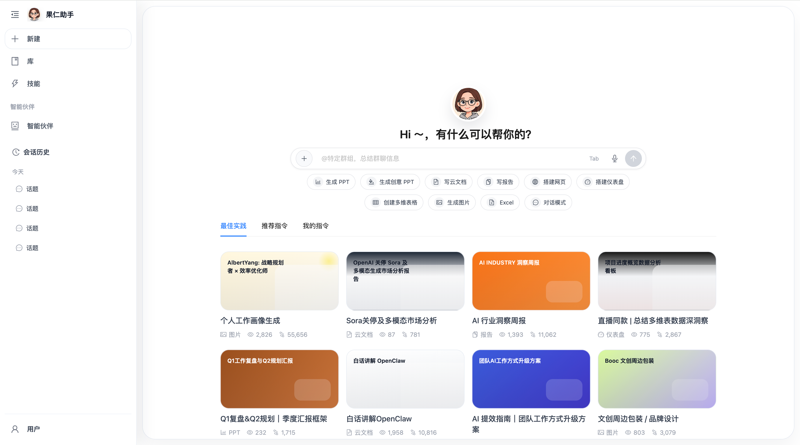
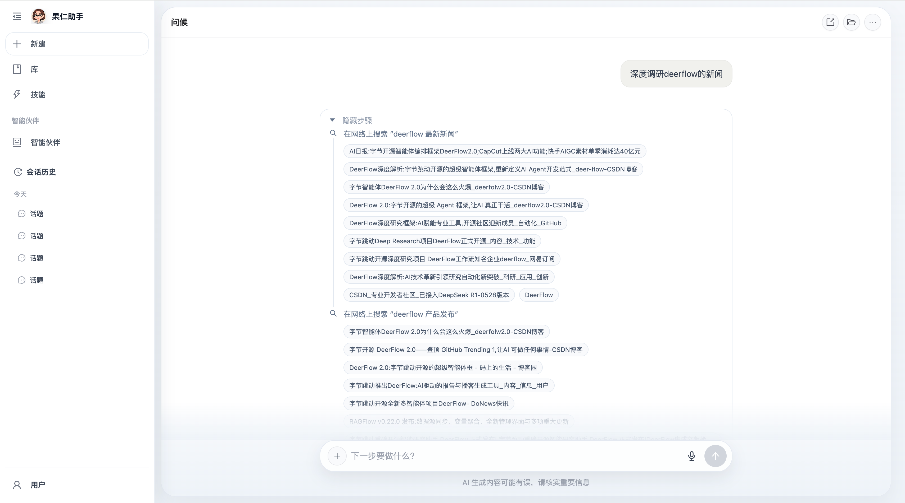
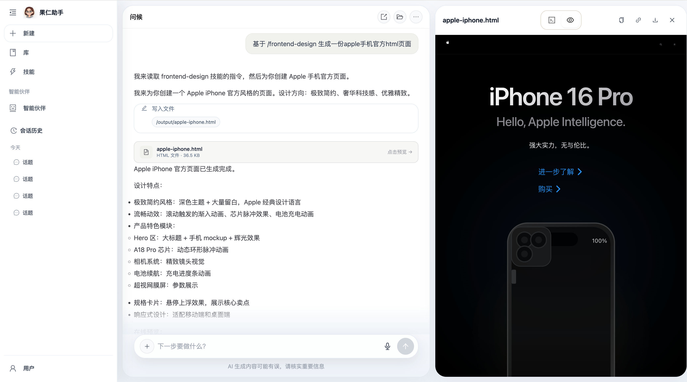

# 果仁助手前端

果仁助手前端项目，基于 `React 19 + TypeScript + Vite + Ant Design` 构建，当前包含首页、聊天页、技能页、智能伙伴、课程表预览和文件预览等核心界面。

## 页面预览

### 首页



### 聊天页 1



### 聊天页 2



## 项目概览

- 首页采用 deerflow 风格的白底工作台布局
- 聊天页支持流式消息、工具调用卡片、Markdown 渲染和右侧预览面板
- 支持 `skill_output` 文件结果展示，包括课程表 JSON 的结构化渲染
- 支持会话历史、智能伙伴页和技能入口联动

## 技术栈

- `React 19`
- `TypeScript`
- `Vite`
- `Ant Design`
- `React Router`
- `Less`
- `remark-gfm / remark-math / rehype-katex / streamdown`

## 本地开发

### 安装依赖

```bash
npm install
```

### 启动开发环境

```bash
npm run dev
```

### 生产构建

```bash
npm run build
```

## 目录结构

```text
src/
  assets/                静态资源
  components/            通用组件、侧边栏、聊天组件
  core/                  消息适配、课程表解析、Markdown 渲染等核心逻辑
  hooks/                 页面与滚动相关 Hook
  pages/                 Home / Chat / Partner / Skills / Library 页面
  services/              会话、技能、预览等接口封装
  workers/               流式消息处理 Worker
doc/                     工作记录与说明文档
```

## 文档说明

- 工作记录统一放在 [`doc`](./doc) 目录
- 当天开发改动会记录到 `工作记录 - YYYY 年 MMDD.md`

## 仓库说明

当前 README 里的首页展示图来自最新首页 UI 截图，方便在仓库首页直接查看整体视觉效果。
